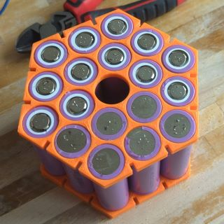
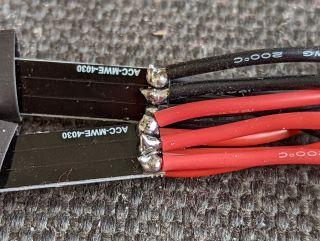
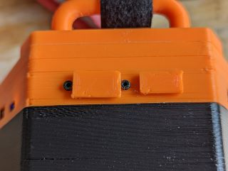

# Hexagonal-Power-Bank
Assembly guide and 3D printing models for my modular 18 cell power bank

0. ## Contents
	1. [Warnings and Disclaimers](#Warnings-and-Disclaimers)
	2. [Introduction](#Introduction)
	3. [Bill of Materials](#bill-of-materials)
	4. [Assembly](#Assembly)
		1. [Casing](#Casing)
		2. [Cell Cage](#cell-cage)
		3. [Lid Section](#lid-section)
	5. [Charging](#Charging)

0. ## Warnings and Disclaimers
	First and Foremost - **You are responsible for your own safety**. I am not liable for the outcomes if you follow this guide. 
	
	It is assumed that you have compentency in (but not limited to) the following: handling Lithium batteries, electronics, soldering, spot welding, 3D printing, use of adhesives, etc.
	
	### Safety Advisories:
	* BATTERIES ARE ALWAYS LIVE!!!
		- You can't turn batteries off.
		- It is extremely easy to short circuit batteries and cause sparks.
		- Electrical shorts can do the following:
			+ Damage your tools
			+ Burn your skin
			+ Start fires
	* The nickel strips you will be spot welding with are sharp and it is too easy to cut yourself.  
	Ask me how I know!  
	
		- If you have to remove a Nickel strip that has been spot welded, use tools rather than fingers, BUT BEWARE OF ELECTRICAL SHORTS!
	* When spot welding, wear safety glasses.
	* When soldering or using adhesives, have a well ventilated environment.

1. ## Introduction
	I'll keep this brief. The main use for this is to recharge RC vehicle batteries when you're out in the field, and because there was space, I threw in a bunch of USB outlets and a wireless charging pad.
	
	Did I need to make this? Not really, but I find the process incredibly therapeutic. I believe a lot of us in the FPV hobby get the same effect. You know what I'm talking about!
	
	I never intended to release plans for this project. However, it was gratifying to receive all the positive attention on the various Facebook groups I posted to. So much so, that various people have ended up contributing to tweaks of the design (I apologise for not keeping a list of all your names).
	
	So, here's a guide as a **THANK YOU** to everyone!

1. ## Bill of Materials (BOM)
	To the best of my recollection, here's what you need to reproduce my build.

	* **18x 21700 Lithium Ion Batteries**.
		- I used `Bak N21700CG-50`. They are 5 Amp Hours each and rated for 10 Amp discharge. Use whatever you can procure, just make sure they're all identical!
	* **3D printing filament**.
		* That's up to you. I haven't calculated the total mass of material, but let's just say it's only a few hundred grams.
	* **Screws**:
		- 6x M3.5x75mm bolts
		- 5x M2x25mm bolts
		- 2x M2x10mm bolts
		- 2x M2 washers
		- 2x M2 nuts
	* **Adhesives**:
		- Cyanoacrylate (e.g., Gorilla Glue), used for places where the prints needs to be permanently bonded.
		- E3000. This stuff holds on very hard. It sets like rubber so can be peeled off if nedded. Best of both worlds.
	* **Electronic Modules**:
		- Battery Management System (BMS)  
			+ There are a lot of options out there, and so you'll have to get something that suits your battery configuration. My build was 3S6P with cells rated for 10 Amps. I used a 40 Amp BMS which meant that the cells would never get too taxed.
			+ [BMS 3S 40A BMS board 11.1V 12.6V 18650 lithium battery protection board, drive drill 40A current](https://www.aliexpress.com/item/32956650573.html)  
			+ 
		- Wireless charging module (optional)
			+  [20W High Power 5V 13.5V Fast Charging Wireless Charger Transmitter Module Type-c USB + Coil Qi Universal For Phone Battery](https://www.aliexpress.com/item/1005002996173955.html)  
			+ 
		- Quickcharge / Apple Fast charge USB A Module (Qty 3)
			+  [5PCS USB DC-DC Buck Converter Charging Step Down Module Fast Quick Charger 6-32V 9V 12V 24V to 3V 5V 12V Circuit Board](https://www.aliexpress.com/item/32908913001.html)  
			+ 
		-  USB C Power Delivery Module (Qty 3)
			+  [Type-C 20W Quick Charging Module QC 3.0 PD3.0 5V 9V 12V Overvoltage/Over Temperature Protection For 18650 Battery Power Bank](https://www.aliexpress.com/item/1005003733377372.html?spm=a2g0o.order_list.0.0.54fb1802LUxs8j)  
			+ 
		- Battery Meter
			+ My configuration was 3S, so I got a 3S battery meter, and the lid is structured to match this part. If you go, say 6S, you'll have to figure out your own solution to the battery meter.
			+ [1S 2S 3S 4S Single 3.7V 18650 Lithium Battery Capacity Indicator Module Percent Power Level Tester LED display board](https://www.aliexpress.com/item/1005001962183752.html)
			+ 
		- USB Lithium Charging Module
			+ You can regard this as optional, but I liked the idea of being able *trickle charge* this from any old phone charger. 
			+ [Type C BMS 2S 3S 4S Charger 21700 18650 Polymer Li-Ion 7.4V 11.1V 14.8V to 8.4V 12.6V 16.8V 1A 2A 4A Boost Power Bank Charging](https://www.aliexpress.com/item/1005003680813897.html)
			+ 
	- Electrical connections
		+ 18 gauge wire for charging modules
		+ 16 gauge wire for main power busses
		+ Nickel Strip (thickness will depend on your spot welder)
		+ Any kind of 2 pin male-female connector pair (for the wireless pad)
		+ XT60E-M (male panel mount)
		+ XT60-F
		+ XT60-M
		+ JST-XH 4 pin, (2x male)
		+ JST-XH 4 pin female lead. (Assuming a 3S configuration)
		+ Self adhesive heatsinks (e.g. for a Raspberry Pi) for BMS cooling.
		+ [Mini Racewire](https://www.flyingtech.co.uk/cables-connectors/tbswhitenoisefpv-x-tbs-race-wire-pcb-full-mini-set-6#:~:text=Race%20Wire%20is%20the%20perfect,of%20the%20Race%20Wire%20board.) - optional but useful for connecting all the modules together in parallel.
		+ 30cm Velcro battery strap (This is an optional part for one of the handle mounts) 	
	- **Consumables**
		+ Variety of shrink tube
		+ Electrical Tape
		+ Solder and flux
		+ Bandages (*Just joking. No really, have bandages*)

1. ## Assembly
	1. ### Casing
		`Print STL: case-FINAL.stl.`
	
		This is the largest single piece. This is what everyting else attaches to, so no other instructions needed!
		
		
	1. ### Cell Cage
		`Print STL: Cell-Holder-Plate.stl, Qty 2.`
		
		`Print STL: Cell-Holder-Strut.stl, Qty 12.`
		
		`Electronic parts: BMS and heatsinks.`
		
		`Other materials: glue, batteries, nickel strips, kapton tape, shrink tube, 16 gauge wire, 3S balance lead, XT60 (female) connector.`
		
		`Tools: Spot welder, rubber mallet (optional), soldering iron, scissors, wire snips, exacto knife or wirestrippers.`
		
		***!!! Note: Ignore the layout/polariteies of the batteries in these photos. See the Wiring graphic below for a better layout !!!***
		
		1. First, print two copies of `Cell-Holder-Plate.stl`.   
		
		
		1. Then stand your batteries in one of the prints, and slot the second one around the top of the cells. Depending on the tollerances of your printer and the thickness of the shirnk wrap on the batteries, a some gentle *percussive persausion* may be needed (rubber mallet is good for this).  
		
		
		1. Print twelve copies of `Cell-Holder-Strut.stl`.
		
		1. Place the battery assembly on its side, ready to place the struts into the slots. Before placing each strut, add a **tiny** drop of cyanoacrylate (gorilla!) glue. Depending on your printer tollerances, the rubber mallet may be needed to get the struts all the way into their slots   
		
		
		1. Leave the assembly on some paper towel (or other disposable surface), and leave a few hours for the glue to set.
		
		1. #### Wiring
		
			`Requirements: 16awg wire, nickel strip, spot welder, soldering iron and solder, shrink tube.`
		
			1. This is where we start spot welding. I will assume you have experience of this. When I built my pack, I set my cells in a 3S6P configuration, but you may be using something else (6S3P, 1S18P), so my advice here as guidance.
			
			1. Because of the hexagonal shape, battery placement is more complicated than a simple grid layout. The main concern is to keep equal voltages together, and not to mix areas of common voltage. Otherwise, when you connect them in parallel there will be many places where short circuits (i.e. sparks) could happen. See the graphic below  
			
			
			1. Once the batteries are connected with nickel strips, we need to add wires that will then be connected to the BMS. My solution was solder the ends of the wires to a nickel strip, cover the solder joint with shrink tube, then spot weld the exposed strip to the strips we have welded to the batteries.  
			
			
			1. Once they are connected to the batteries, cover in kaptop tape to prevent accidental short circuits. It should then look like this:  
			 
			
			1. Finally, print two copies of `Strip-cover.stl`. This is a thin layer of plastic to provide some stronger protection to the top and bottom of the cell assembly. Affix it with either a non-permanent glue or some electrical tape.  
			
		
		1. #### Add BMS
			`Requirements: BMS, heat sinks (optional), non-permanent glue (e.g. E3000), XT60 (female) connector, 3S balance lead`
		
			1. Solder two 16awg wires to a female XT60 connector (roughly 3" to 4"), and add the heatsinks to the BMS FETS if you expect to be pulling high current.
			
			1. Tin the pads on the BMS, and solder the XT60 lead to the P+ and P- pads.
			
			1. Next, glue the BMS to the top PLA cover sheet, positioned as shown in the next image (position matters for how it will be installed into the case later). I reccomend spreading E3000 around with a spatula!  
			
			
			1. Next, you'll need to solder all the wires to the BMS. Here you can trim the wires to the optimum length. Some BMS boards have their pads labelled with their corresponding voltage, some have "B0/B-", "B1" "B2", "B3/B+". Just connect them up in ascending voltage order.
			
			1. If you want to be able to use an external balance charger, you'll also need to solder the balance lead to these pads too. See the previous image for an example.
		
		1. #### Installing into Case 
			`Print: Holding Bracket v4.stl`
			
			`Requirements: Holding Bracket v4.stl, case-FINAL.stl, 5x M2x25mm bolts/screws, screwdriver (preferably powered).`
			
			1. Slide the battery cage (*can we call it the **POWER CORE**, please?*) into the case (`case-FINAL.stl`). If your tollerances are right, there should be a little friction, but not so much that cannot be overcome by the weight of the batteries.
			
			1. Lay the holding bracket (`Holding Bracket v4.stl`) on top top of the battery cage, around the BMS, and line up with the internal screw holes in the casing.
			
			1. Screw in the M2 bolts. I recommend a powered screw driver or drill, because for the first time the screws will be tapping into the plastic.  
			
			
			1. Make sure the pressure is evenly distributed, and that the battery cage is fully immobilised. As ever, be careful not to over tighten.  
			
		
	1. ### Lid Section
		The lid of this park was made to be interchangeable. So far, I only have one design, so there's nothing to interchange it with! I invite you to redesign and create your own lid with all the ports and electronics that you need for your projects. I designed all of this in Blender, rather than a CAD package, simply because it's what I use in my day job, so it was the quickest way to get what I needed.

		1. #### Lower Lid
			`Print: lower-lid-FINAL.stl`
			or
			`Print: lower-lid-no-cut-outs.stl (modify to your own specs)`

			The 'no cut outs' STL is supplied so that you can remix the design to whatever set of ports and electronic modules you wish to use in your build. For example, the configuration presented here has a 3S battery configuration. However, if you go for 1S or 6S, you will need either no balance port, or a 6s balance port. You may also use different USB charging modules. It's your choice.

		1. #### Cabling
			`Tools: Wire cutters, soldering iron, solder, heat gun.`

			`Requirements:`
			* E600 Glue
			* 16 gauge wire
			* 18 gauge wire
			* Shrink tube (various sizes)
			* JST-XH 4 pin (2x male)
			* XT60E-M (male panel mount)
			* XT60-M
			* 2 pin power connector, male and female pair (for wireless charging module, type of connector doesn't matter).
			* All the electronic modules you have chosen for your own particular build. The default (i.e. my original build) is as follows (see BOM above):
				* 3x USB A Quick Charge Modules
				* 3x USB C Power Delivery Modules
				* USB C 3S charging module
				* Battery Meter

			Begin by creating a power cable with the XT60-M connector with 16 gauge wire. This will be how the lid section connects to the battery pack in the case. Connect this power cable to the Mini Racewire. We are using the race wire as a power bus - if you have a better idea for how to connect one power cable to many outputs in parallel in the fairly restricted volume of the lid section, then go for it!

			In order for the race wire to distribute power to all of its solder pads, you must make sure to bridge the pads adjacent to where the power cable has been attached.

			Now create the balance port (if you are using one). Take the two JST-XH (4pin) sockets, and connect them with 18 gauge wire. You should use shrink tube to cover the pins. This 'Male to Male' cable will connect to the balance cable from the battery pack, and the other end will be fitted into the lower lid section.

			Now solder 16 gauge wire to the XT60E-M panel mount port.

			Next, place all the electronic modules into the lower lid (without glue), and measure out the lengths of wire you will need. Then solder each of the required lengths of 18 gauge wire to the electronic modules.

			Before soldering everything to the race wire, make sure you have shrink tube slotted over the race wire.

			See the images below for reference:
			
			 

			 

		1. #### Mid Lid Extension
			`Print: Lid-extender.stl (scale height to your own needs)`

			I created this section because I underestimated how much space would be needed for all the cables. With your own set up, you may scale the height to whatever, or not even include it at all.

		1. #### Upper Lid
			`Print: Upper Lid (no cut-out).stl`

			or

			`Print: Upper Lid (cut-out).stl on top of wireless-logo.stl`

			`Requirements:`
			* Wireless charging module
			* 18 gauge wire
			* Wire cutters
			* Solder
			* Soldering iron
			* E6000 glue
			* Double sided tape
			* Kapton tape
			* The other part of the 2 pin power connector (see cabling requirements).

			This might be your first adventure into two-color 3D printing! To get the Wireless logo embedded into the lid as shown below, first print the wireless-logo.stl in one color. It should only be one layer height, i.e. 0.2mm.

			Next, without removing the wireless logo, load your second color into the printer, and start printing the version of the upper lid that has the wireless logo cutout. The printer will simply make the second print around the first print and they will fuse together.

			If you intend to use wireless charging, solder the 2 pin connector to its PCB, and then wrap the entire PCB in kapton tape. Next either use double sided tape or E6000 glue to fix the wireless charging coil into the circular receptacle in the upper lid. **Be sure to have the black ferrite pad facing inwards!**

			Finally, use double sided tape or glue to fix the PCB to the underside of the charging coil.

			 

			 

		1. #### Lid Assembly
			`Print: JST Glue in Support.stl, Meter-Holder.stl, Meter-button-cover.stl`
			`Requirements:`
			* Lower Lid (4.3.1)
			* Cabling Harness (4.3.2)
			* Mid lid extension (4.3.3)
			* Upper Lid (4.3.4)
			* M2 Nuts, bolts and washers
			* E6000 glue
			* Cyanoacrylate (gorilla) glue
			* M3 long bolts
			* Rotary tool with a 3mm diameter drill bit.

			Start by milling out the screw holes in the three lid sections until the long M3 bolts can freely slot through them. (This makes screwing the entire lid section to the case much easier).

			Fit the battery meter into its 3d printed holder and slot the button cover over the brass button. The print may need some adjustments with either a cutting wheel, or soldering iron, to make the battery meter fit correctly.

			For each USB module in turn, apply some E6000, slot the module into its lower-lid slot, and hold with some pressure while the glue adheres.

			Apply Cyanoacrylate (gorilla) glue to the lower lid where the battery meter holder will go, and press the holder (with the meter installed) into place. Again, hold for a moment while the glue sets.

			Take the "JST Glue in Support.stl" that you just printed and use Cyanoacrylate glue to fix it to one end of the male-to-male JST cable you created earlier. Once glued together, then add some glue to the base of the 3D printed support, and slot it into place in the lower lid and hold while the glue sets.

			Take the M2 nuts and bolts and washers, and use them to screw the XT60E panel mount connector into the lower lid.

			Now place the mid-lid-extension on top of the lower lid section. You may omit the extension if your wiring harness is more compact than I made mine! You may even find that you need two extensions, or a height-scaled extension.

			Once the extension is over the lower section, plug the wireless charging module into the cable harness, via the 2 pin connector.

			Finally, place the upper-lid on top of the rest of the lid assembly. All the sections should fit flush to each other, without putting excessive pressure on the electronics inside. To hold this section together, loosely slot the long M3 bolt through all size holes.

			Please see the photos below for reference.

			  
			 

	1. ### Installing lid onto case
		`Requirements: Power drill with M3 Hex bit, or a M3 allen key and lots of patience and a strong arm.`

		Well done, you've made it this far!

		Start by connecting the XT60 and JST balance leads of both the lid section and the power core (there, I named it!). Next place the lid section over the case, and slide it down the bolts so that it is flush to the case.

		Now, take your power drill (or allen key if you're a masochist), and drill each bolt down half way. Make sure everything is lining up still, and drill them down the rest of the way.

		**Warning!!!** If bolts are drilled at high speed all at one go, lots of heat will be generated through friction. This is okay but not ideal. It's best to take things slow and steady!

		 

	1. ### Handles
		If you would like to fit a carrying handle we have two options. The heavy duty handle creates a large handle that makes the pack easy to pick up and go. The 'flexible' handle gives you two strong loops through which to thread a velcro strap, or rope, or anything you want. The 'flexible' option has the advantage of leaving room up top to place a phone for wireless charging!

		In each case, the handles are fitted on top of the lid section and held in place by the existing M3 long bolts.

		1. #### Heavy Duty
			`Print: HeavyDutyHandle.stl`

			 

		1. #### Flexible Handle Mounts
			`Print: 2x fleximount.stl`

			 
		

	1. ### Port Covers
		`Print: xt60-cover.stl & Balance-Cover.stl`

		These are optional covers to protect the live contacts from being short circuited.

		 

	1. ### Decorative Base
		`Print: shoe-batt-orange.stl ON TOP OF shoe-batt-black.stl`
		
		This is just a *for fun* Addition. Use the same two color approach as described for the wireless logo on the lid. Once printed, use gorilla glue to fix this onto the base of the power bank. There's no functional reason to do this, it's just an easter egg, and might hid any ugly first layer on your case.
	
		 

1. ## Charging
	This is the subject that most concerns me about letting this design out into the wild. You really need to be familiar with lithium battery charging, **AND** the specifications of the batteries you have selected.  Do your due diligence and proceed with caution - success or failure is on your shoulders, not mine. Note that 'failure' will involve fire and destruction of property and potentially life. So please be careful, and ***NEVER CHARGE WHILE UNATTENDED.***

	As a rule of thumb, always charge Lithium Ion cells at a **0.5 C rate**, no faster. In my example, I used 5Ah cells, in 3S6P configuration. This meant I had a total capacity of 30Ah (at 3S or 12.6V). Therefore, `0.5C * 30Ah = 15 Amps maximum charging rate`.

